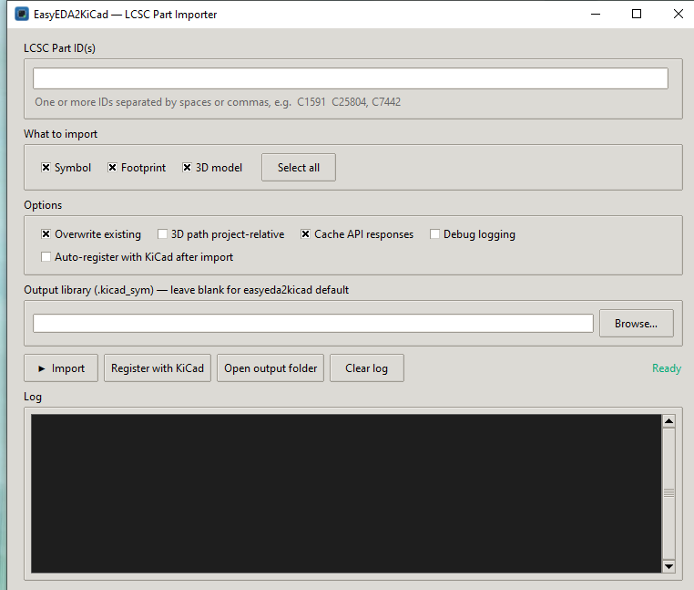

# EasyEDA2KiCad GUI

A simple cross-platform desktop GUI (**Windows, Linux, macOS**) for importing
**LCSC / EasyEDA parts into KiCad**.

It is a graphical front-end for the excellent command-line tool
[**easyeda2kicad**](https://github.com/uPesy/easyeda2kicad.py) by *uPesy* — you
type an LCSC part number, tick what you want (symbol / footprint / 3D model),
and it downloads and converts the part into a KiCad library. It can also
**register that library with KiCad for you** so the parts show up automatically.



> **Transparency note:** This tool does two things that touch your system —
> it **writes library files** to your Documents folder, and (only when you click
> *Register with KiCad*) it **edits KiCad's configuration files**. Exactly what
> it writes and where is documented below. It makes a backup of every KiCad
> config file before changing it. This project was built as a personal helper
> tool with AI assistance; read the source — it's short and plain Python.

---

## What it does

- Downloads any LCSC part by ID (e.g. `C1591`) via easyeda2kicad and converts it
  to KiCad format.
- Lets you choose **Symbol**, **Footprint**, and/or **3D model**.
- Streams the tool's live output into a log panel.
- Remembers your settings between runs.
- **One-click "Register with KiCad"** — makes KiCad aware of the generated
  library (symbols, footprints, and the `EASYEDA2KICAD` path variable for 3D
  models), across every installed KiCad version it detects.
- Optional **auto-register after each import**.
- "Open output folder" and an app icon / desktop shortcut for convenience.

---

## Where your files are saved

When the **Output** box is left blank, easyeda2kicad writes everything under:

```
C:\Users\<you>\Documents\Kicad\easyeda2kicad\
├── easyeda2kicad.kicad_sym       ← symbols
├── easyeda2kicad.pretty\         ← footprints (*.kicad_mod)
└── easyeda2kicad.3dshapes\       ← 3D models (*.wrl, *.step)
```

If you set a custom path in the **Output** box, it uses that name/location
instead.

---

## What "Register with KiCad" changes (and how it's kept safe)

KiCad does **not** scan folders for libraries — it reads config files. So to make
your imported parts appear, this tool edits, **per installed KiCad version**,
the config files in KiCad's settings folder:

| OS | KiCad settings folder |
| --- | --- |
| Windows | `%APPDATA%\kicad\<version>\` |
| macOS | `~/Library/Preferences/kicad/<version>/` |
| Linux | `$XDG_CONFIG_HOME/kicad/<version>/` (default `~/.config/kicad/<version>/`) |

In each it changes:

| File | Change |
| --- | --- |
| `sym-lib-table` | adds/updates an `easyeda2kicad` symbol-library entry |
| `fp-lib-table` | adds/updates an `easyeda2kicad` footprint-library entry |
| `kicad_common.json` | sets the `EASYEDA2KICAD` environment variable to the library folder (so 3D-model paths resolve) |

Safety measures:

- **A backup is made** of every file before it's modified: `<file>.e2k-bak`.
- The operation is **idempotent** — running it again updates the existing entry
  instead of adding duplicates.
- **Close KiCad before registering.** KiCad rewrites these files when it exits,
  so it would discard the changes. The tool detects a running KiCad and warns you.

You only need to register **once**. After that, every future import lands in the
same library files KiCad already knows about, so new parts appear automatically
(reload libraries or restart KiCad).

To undo a registration, restore the `.e2k-bak` files or remove the
`easyeda2kicad` entries from the two lib-table files.

---

## Platform support

| | From source (Python) | Prebuilt download |
| --- | --- | --- |
| **Windows** | ✅ | ✅ [Releases](../../releases) |
| **Linux** | ✅ | ✅ [Releases](../../releases) |
| **macOS** (Apple Silicon) | ✅ | ✅ [Releases](../../releases) |

The Python code is fully cross-platform (KiCad paths, "open folder", process
detection, and the window icon all adapt to the OS).

Prebuilt binaries for all three platforms are produced by GitHub Actions
(`.github/workflows/build.yml`) on each version tag — because **PyInstaller
cannot cross-compile**, each is genuinely built on its own OS runner. Intel-Mac
or other-arch users can build locally with `build.sh` (one command, see below).

## Requirements

- To run **from source** (any OS): Python 3.9+ and the `easyeda2kicad` package.
  `tkinter` ships with Python on Windows/macOS; on some Linux distros install it
  separately (e.g. `sudo apt install python3-tk`).
- To run the **prebuilt Windows app**: nothing — Python and easyeda2kicad are
  bundled inside the executable.

---

## How to run

### Option A — Prebuilt app (easiest)

Download your platform's archive from the [Releases](../../releases) page and
extract it. Keep the `_internal` folder next to the executable — it won't run
without it. No Python installation is required; everything is bundled.

- **Windows** (`...-windows-x64.zip`): double-click `EasyEDA2KiCad.exe`.
  Optionally run `create_shortcut.bat` for a Desktop shortcut. SmartScreen may
  warn on first run (unsigned) → *More info → Run anyway*.
- **Linux** (`...-linux-x64.tar.gz`): `tar -xzf` it, then run
  `./EasyEDA2KiCad/EasyEDA2KiCad`.
- **macOS** (`...-macos-arm64.zip`): unzip, then run
  `./EasyEDA2KiCad/EasyEDA2KiCad`. Gatekeeper may block an unsigned app →
  right-click → *Open*, or `xattr -dr com.apple.quarantine EasyEDA2KiCad`.

### Option B — Run from source (Windows, Linux, macOS)

```bash
pip install easyeda2kicad
python easyeda2kicad_gui.py     # or: python3 easyeda2kicad_gui.py
```

That's it. The GUI uses only the Python standard library (`tkinter`) plus
`easyeda2kicad`. On Debian/Ubuntu you may first need `sudo apt install python3-tk`.

### Then, in the app

1. Type one or more LCSC IDs (space- or comma-separated). `C1591`, `1591`, and
   `c1591` all work.
2. Tick **Symbol / Footprint / 3D model**.
3. Click **▶ Import**.
4. (Once) close KiCad and click **Register with KiCad** — or tick
   **Auto-register after import**.
5. Open KiCad → the `easyeda2kicad` symbol & footprint libraries are there.

---

## Building the desktop app yourself

Requires [PyInstaller](https://pyinstaller.org/) (and Pillow only if you want to
regenerate the icons). **Build on the OS you want to target** — PyInstaller does
not cross-compile.

```bash
pip install pyinstaller pillow easyeda2kicad
```

**Windows:**

```bat
build.bat
:: or:  python -m PyInstaller easyeda2kicad_gui.spec --noconfirm
:: optional Desktop shortcut:
create_shortcut.bat
```

**Linux / macOS:**

```bash
chmod +x build.sh
./build.sh
# or:  python3 -m PyInstaller easyeda2kicad_gui.spec --noconfirm
```

The result is a **one-folder** build. On Windows you get
`dist\EasyEDA2KiCad\EasyEDA2KiCad.exe`; on Linux/macOS,
`dist/EasyEDA2KiCad/EasyEDA2KiCad`. Distribute the whole `dist/EasyEDA2KiCad`
folder — the executable needs the `_internal` folder beside it.

---

## Files in this repo

| File | Purpose |
| --- | --- |
| `easyeda2kicad_gui.py` | The GUI (Tkinter). Runs easyeda2kicad in-process and streams its output. |
| `kicad_register.py` | Logic that registers the library into KiCad's config (with backups). |
| `make_icon.py` | Generates `app.ico` + `app.png` (needs Pillow). |
| `easyeda2kicad_gui.spec` | PyInstaller build recipe (one-folder, windowed, icon). |
| `build.bat` / `build.sh` | Build the app on Windows / on Linux–macOS. |
| `create_shortcut.bat` | Creates a Desktop shortcut to the built app (Windows). |
| `app.ico` / `app.png` | Application icon (Windows / Linux–macOS). |
| `.github/workflows/build.yml` | CI that builds Windows/Linux/macOS apps and attaches them to each tagged release. |
| `LICENSE` | GNU AGPL-3.0. |

Build outputs (`build/`, `dist/`), caches, and the generated
`.e2k_gui.json` settings file are git-ignored.

---

## Credits & license

- **Core conversion engine:** [easyeda2kicad.py](https://github.com/uPesy/easyeda2kicad.py)
  by *uPesy* — this GUI would not exist without it. All the hard work of talking
  to the EasyEDA API and producing valid KiCad libraries is theirs.
- This GUI wrapper is a thin convenience layer around that tool.

Because it builds on easyeda2kicad, which is licensed under the **GNU Affero
General Public License v3.0**, this project is released under the **same license**
(AGPL-3.0). See [`LICENSE`](LICENSE).

## Disclaimer

Provided as-is, with no warranty. It modifies KiCad configuration files as
described above; back up your KiCad config if you're cautious, and always close
KiCad before registering. Not affiliated with or endorsed by LCSC, EasyEDA, or
KiCad.
